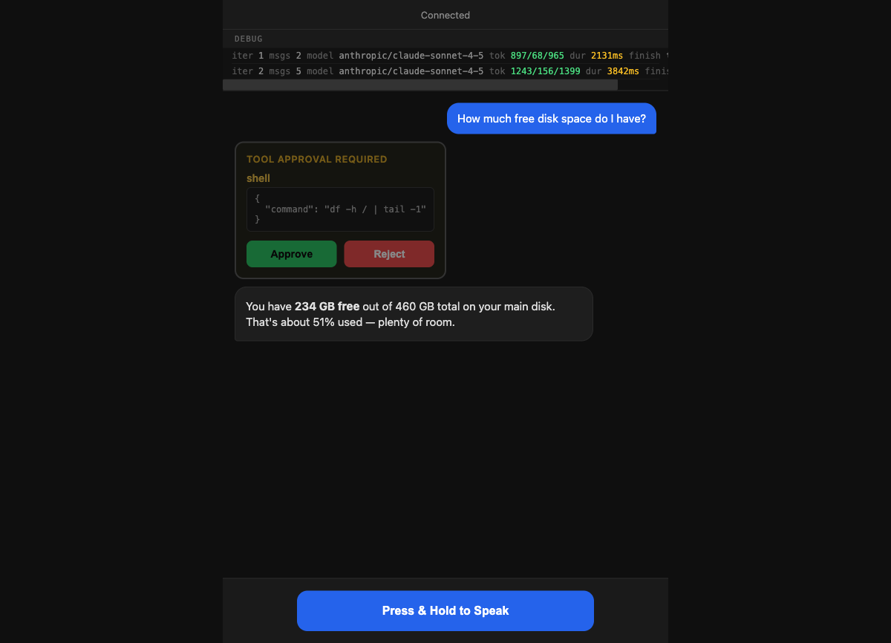
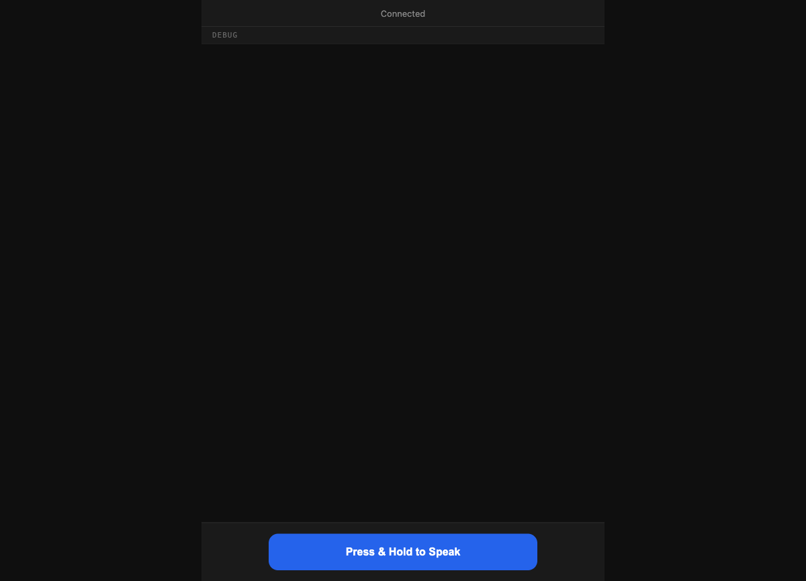
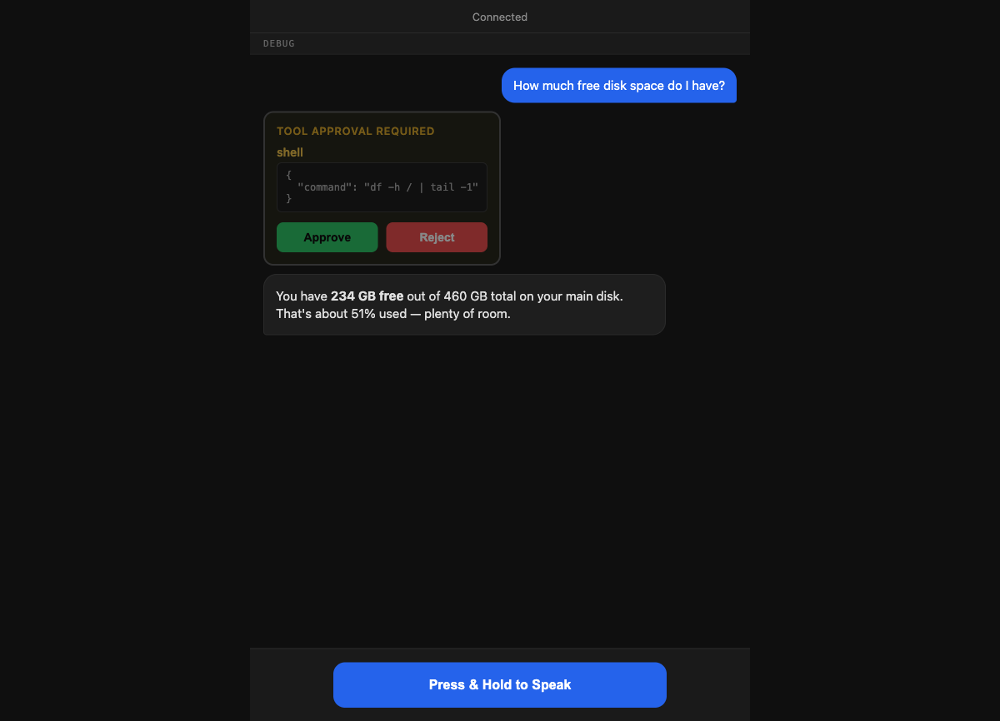
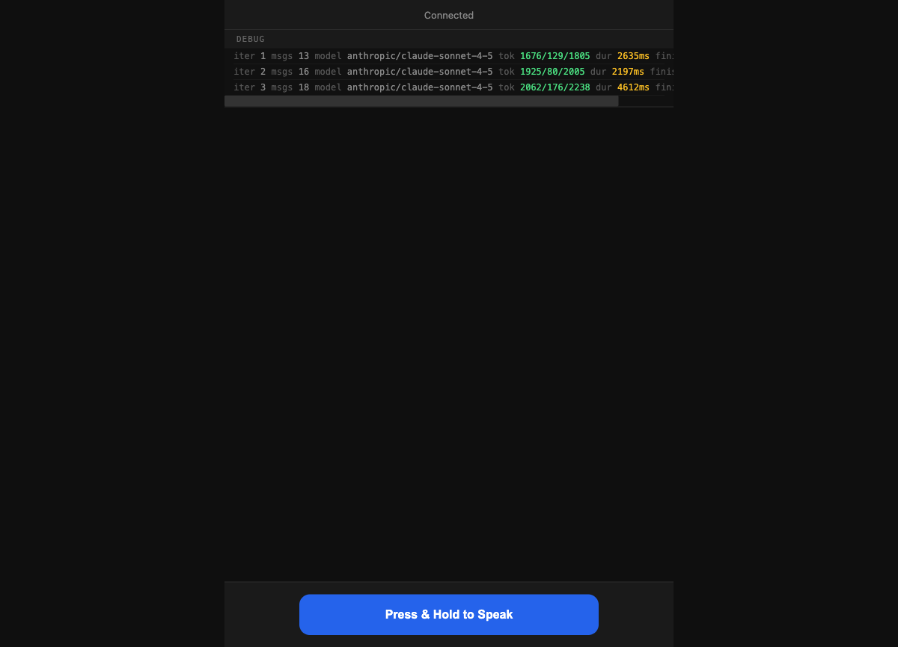
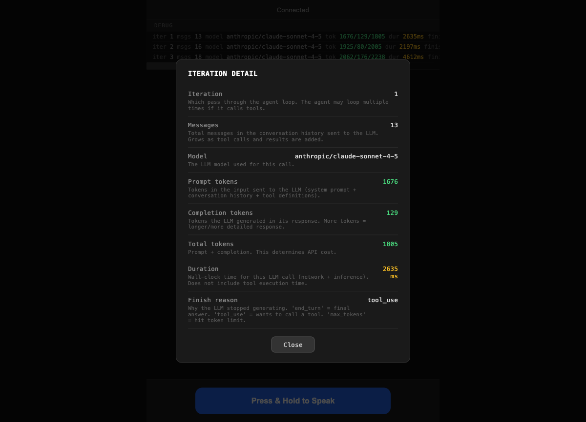

<div align="center">
  <h1>nano-claw voice loop</h1>
  <p>
    A voice-powered AI agent you talk to in your browser. Ask questions, approve tool calls, hear responses — all by voice.
  </p>
  <p>
    
    
    
    
  </p>
</div>

<p align="center">
  
</p>

## What is this?

You talk to an AI agent through your browser. It listens (Whisper STT), thinks (Claude), speaks back (Kokoro TTS), and can run tools on your machine with your approval.

**The loop:** You speak → Whisper transcribes → Claude responds → if it needs a tool, you approve/reject → Claude continues → Kokoro speaks the answer back.

## Architecture

The system runs as **two processes** — the STT service runs natively on your Mac for speed, and everything else runs in Docker:

```
┌─────────────────────────────────────────────────────────────────┐
│  Your Mac (native)                                              │
│                                                                 │
│  ┌──────────────────────────┐                                   │
│  │  STT Service              │  ← Runs natively for Metal GPU   │
│  │  faster-whisper           │  ← 3-5x faster than Docker CPU   │
│  │  POST /transcribe         │                                   │
│  │  port 8200                │                                   │
│  └────────────▲─────────────┘                                   │
│               │ HTTP                                             │
│  ┌────────────┴──────────────────────────────────────────────┐  │
│  │  Docker container                                          │  │
│  │                                                            │  │
│  │  ┌──────────────────┐    ┌─────────────────────────────┐  │  │
│  │  │  nano-claw API   │    │  Voice Server (Python)      │  │  │
│  │  │  (TypeScript)    │    │                             │  │  │
│  │  │                  │    │  WebSocket ←→ Browser       │  │  │
│  │  │  Agent loop      │◄──►│  Kokoro TTS (text→speech)  │  │  │
│  │  │  Tool execution  │    │  WebRTC audio streaming    │  │  │
│  │  │  Memory          │    │                             │  │  │
│  │  │  port 3001       │    │  port 8080 → 9090          │  │  │
│  │  └──────────────────┘    └─────────────────────────────┘  │  │
│  └────────────────────────────────────────────────────────────┘  │
└─────────────────────────────────────────────────────────────────┘
```

### Why is STT a separate service?

**Docker Desktop on Mac cannot access the GPU.** Docker runs a Linux VM under the hood, and Apple's Metal GPU is not passed through. This is a hard limitation — there is no workaround.

Whisper running on Docker CPU takes 1-2 seconds for a short clip and 30 seconds to load the model the first time. Running natively on your Mac with Metal acceleration is **3-5x faster**.

By extracting STT into a standalone HTTP service, the voice server in Docker simply POSTs audio bytes to `http://host.docker.internal:8200/transcribe` and gets text back. Clean, fast, and the Docker container gets simpler (no Whisper model to download).

### Data flow

```
You speak into mic
    → WebRTC audio stream to Docker container
    → Voice server sends audio bytes to STT service (native Mac, port 8200)
    → Whisper transcribes to text (Metal-accelerated)
    → Voice server POSTs text to nano-claw API
    → Claude generates response (may request tools)
    → If tool_pending: browser shows approval card, you approve/reject
    → If approved: tools execute, loop continues
    → Final text sent back via WebSocket
    → Kokoro converts to speech (in Docker)
    → WebRTC audio stream back to your browser
You hear the answer
```

## Quick Start

### Prerequisites

- [Docker](https://docs.docker.com/get-docker/) installed and running
- [Python 3.10+](https://www.python.org/) on your Mac (for the STT service)
- An [Anthropic API key](https://console.anthropic.com/)

### 1. Clone

```bash
git clone https://github.com/davidbmar/2026-nano-claw-voice-loop-tts-stt.git
cd 2026-nano-claw-voice-loop-tts-stt
```

### 2. Set your API key

```bash
export ANTHROPIC_API_KEY=sk-ant-...
```

Or create a `.env` file in the project root:
```
ANTHROPIC_API_KEY=sk-ant-...
```

### 3. Run

```bash
./run.sh
```

This single command:
- Starts the STT service natively on your Mac (for Metal GPU acceleration)
- Builds the Docker image (TypeScript API server + Python voice server + TTS)
- Starts the Docker container, which calls the local STT service for transcription
- The Whisper model downloads (~75 MB) on the first transcription and is cached after that

### 4. Open your browser

Go to **http://localhost:9090**

Allow microphone access when prompted. Once it says "Connected", you're ready.

### 5. Talk

**Hold** the blue button and speak. **Release** to send. The agent will think, optionally request tool approval, and speak its answer back.

### 6. Stop

Press `Ctrl-C` — this stops both the Docker container and the STT service.

## How It Works

<p align="center">
  
</p>

### Voice conversation

Hold the button, ask a question, release. Your speech is transcribed and shown as a blue bubble. The agent's reply appears as a gray bubble and is spoken aloud through your browser.

### Tool approval

When the agent wants to run a command (shell, read/write files), it pauses and shows you exactly what it wants to do. You approve or reject.

<p align="center">
  
</p>

### Full conversation flow

A typical interaction: you ask a question → the agent calls a tool → you approve → the agent gives you the answer.

<p align="center">
  
</p>

## Debug Panel

Click the **DEBUG** button to see real-time observability into the agent loop. Every LLM call shows iteration, message count, model, token usage, timing, and finish reason.

<p align="center">
  
</p>

Click any row for a detailed breakdown explaining what each field means:

<p align="center">
  
</p>

### Reading a debug row

```
iter 1  msgs 2  model anthropic/claude-sonnet-4-5  tok 897/68/965  dur 2131ms  finish tool_use
```

| Field | What it means |
|-------|---------------|
| **iter** | Which pass through the agent loop (1 = first call, 2 = after tool result, etc.) |
| **msgs** | Messages in conversation history — grows as tool calls and results are added |
| **model** | The LLM model used |
| **tok** | Tokens: prompt / completion / total — this determines API cost |
| **dur** | Wall-clock time for the LLM call (network + inference) |
| **finish** | Why the LLM stopped: `end_turn` = final answer, `tool_use` = wants a tool, `max_tokens` = hit limit |

See **[docs/DEBUG-PANEL.md](docs/DEBUG-PANEL.md)** for the full observability guide.

## Component Details

| Component | Where it runs | Role |
|-----------|--------------|------|
| **STT Service** | Mac native (port 8200) | Speech-to-text via faster-whisper, Metal GPU accelerated |
| **nano-claw API** | Docker (port 3001, internal) | Agent loop — LLM calls (Claude), tool execution, conversation memory |
| **Voice server** | Docker (port 8080 → 9090) | WebSocket bridge, TTS, WebRTC audio |
| **Kokoro TTS** | Docker | Text-to-speech — runs locally, streams audio via WebRTC |
| **Browser UI** | Your browser | Push-to-talk, chat bubbles, tool approval cards, debug panel |

## Docker Details

### What `run.sh` does

1. Loads `.env` if present
2. Stops and removes any old `nano-claw-voice` container
3. Prunes dangling Docker images
4. `docker build -t nano-claw-voice .`
5. `docker run -it --rm -p 9090:8080` with API key and STT service URL

### Manual Docker commands

```bash
# Build
docker build -t nano-claw-voice .

# Run (make sure STT service is running on port 8200 first)
docker run -it --rm \
  -p 9090:8080 \
  -e ANTHROPIC_API_KEY="$ANTHROPIC_API_KEY" \
  -e STT_SERVICE_URL="http://host.docker.internal:8200" \
  -v nano-claw-models:/app/voice/models \
  nano-claw-voice
```

### Inside the container

The entrypoint starts two processes:
1. `node dist/cli/index.js serve --port 3001` — the TypeScript API server
2. `python -m voice` — the Python voice server on port 8080

The voice server waits for the API to be healthy before starting.

## Troubleshooting

| Problem | Fix |
|---------|-----|
| "Mic access denied" | Allow microphone in browser permissions, use Chrome/Firefox/Safari |
| Stuck on "Connecting..." | Check that the Docker container is running (`docker ps`) |
| Transcription fails | Make sure the STT service is running: `curl http://localhost:8200/health` |
| No sound from agent | Click somewhere on the page first (browsers require user interaction before playing audio) |
| "nano-claw API did not become ready" | Check your `ANTHROPIC_API_KEY` is valid. Check Docker logs: `docker logs $(docker ps -q)` |
| Container won't start | Make sure Docker is running and port 9090 isn't in use |
| STT service won't start | Check Python 3.10+ is installed: `python3 --version` |

## Server Logs

**STT service terminal** shows transcription requests:
```
INFO:     POST /transcribe — 4.56s audio, 0.8s inference → "How much disk space do I have?"
```

**Docker terminal** shows agent loop iterations:
```
voice-server INFO  iter=1 msgs=2 model=anthropic/claude-sonnet-4-5
    tokens={'prompt': 897, 'completion': 68, 'total': 965} duration=2131ms finish=tool_use

(nano-claw): Tool execution complete
    tool: "shell"  success: true  durationMs: 342
```

## Project Structure

```
├── stt-service/
│   ├── server.py              # Standalone STT service (FastAPI + faster-whisper)
│   ├── requirements.txt       # Python deps for STT service
│   └── run.sh                 # Convenience launcher
├── src/
│   ├── api/server.ts          # HTTP API — agent loop with tool confirmation
│   ├── agent/                 # Core agent: loop, memory, context, tools
│   ├── providers/             # LLM providers (Anthropic, OpenRouter, OpenAI, etc.)
│   ├── cli/                   # CLI commands including `serve`
│   └── config/                # Configuration with Zod validation
├── voice/
│   ├── server.py              # aiohttp WebSocket server — bridges browser ↔ API
│   ├── stt.py                 # STT module (used by stt-service, not Docker)
│   ├── tts.py                 # Text-to-speech (Kokoro)
│   ├── webrtc.py              # WebRTC session + STT service client
│   └── web/                   # Browser UI
│       ├── index.html
│       ├── app.js             # WebSocket client, WebRTC, push-to-talk, debug panel
│       └── styles.css
├── Dockerfile                 # Multi-stage build (Node.js + Python)
├── docker/
│   ├── entrypoint.sh          # Starts both servers
│   └── default-config.json    # Default agent config for Docker
├── run.sh                     # One-command Docker build + run
└── docs/                      # Screenshots and debug panel guide
```

## License

MIT — see [LICENSE](LICENSE)
